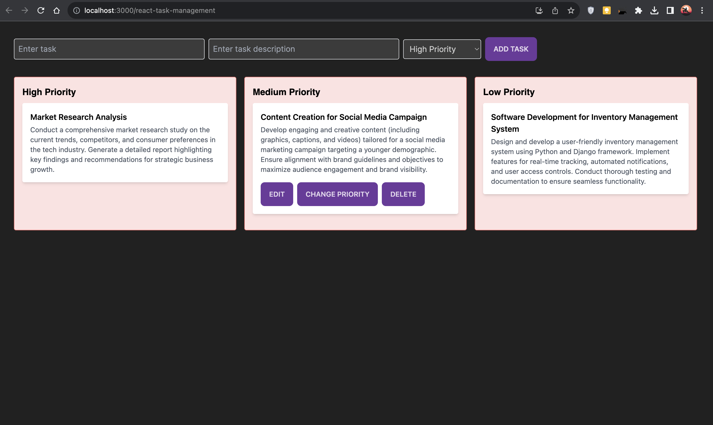

# Task Dashboard App

This Task Dashboard app allows users to manage tasks based on their priority levels. Users can add, edit, delete tasks, and organize them by priority.

## Project Structure

The project structure is organized as follows:

- **src/components:** Contains React components used within the application.
  - `Layout.js`: Component responsible for displaying tasks grouped by priority.
  - `Action.js`: Component containing action buttons for tasks (edit, delete, etc.).
  - Other components specific to the application.

- **src:** Main application files.
  - `App.js`: Root component of the application.
  - Other necessary files for the app logic.

## Installation and Setup

Follow these steps to run the project locally:

1. **Clone the repository:**

2. **Navigate to the project directory:**
```
cd task-dashboard-app
```


3. **Install dependencies:**
```
npm install
```

4. **Run the application:**
```
npm start
```

5. **Access the application:**
Open a web browser and visit `http://localhost:3000` to use the Task Dashboard app.

## Design Choices

- **React Framework:** The project utilizes React for building the user interface due to its component-based structure and efficient rendering.
- **LocalStorage:** Tasks are stored in the browser's localStorage to maintain data persistence.
- **Priority-Based Organization:** Tasks are categorized into High, Medium, and Low priorities for better task management.

## Additional Features Implemented

- **Task Descriptions:** Each task includes an optional description field.
- **Task Actions:** Users can edit, delete, and change the priority of tasks.


##Demo

